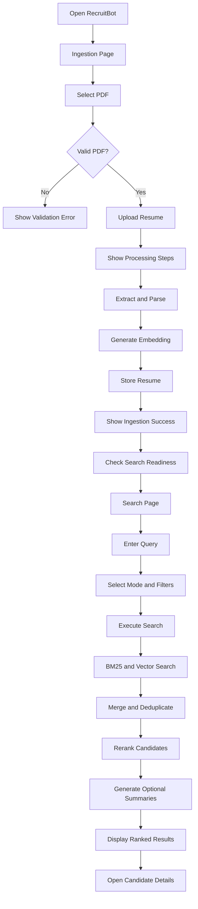

# RecruitBot Frontend Architecture

## 1. Frontend Overview

RecruitBot is a single React, TypeScript, Vite, and TailwindCSS application for resume ingestion and resume retrieval.

The frontend supports:

- Resume PDF upload
- Upload validation and progress
- Resume processing status
- Ingestion success and failure states
- Search by vector, BM25, or hybrid mode
- Candidate ranking and deduplication display
- LLM reranking information
- Candidate fit summaries
- Candidate details

The frontend manages user interaction and presentation. The backend remains responsible for extraction, parsing, embeddings, search, deduplication, reranking, summarization, and database storage.

```text
Frontend responsibilities:
  UI, validation, API calls, state, loading states, error display

Backend responsibilities:
  PDF extraction, parsing, embeddings, search, deduplication,
  reranking, summarization, persistence
```

---

## 2. Frontend Application Flow

```text
Open Application
      |
      v
Resume Ingestion
      |
      v
Upload PDF
      |
      v
Validate File
      |
      v
Process Resume
      |
      v
Generate Embedding
      |
      v
Store Resume
      |
      v
Check Search Readiness
      |
      v
Search Resumes
      |
      v
Merge and Deduplicate
      |
      v
Rerank Candidates
      |
      v
Generate Optional Summaries
      |
      v
Display Candidate Results
      |
      v
Open Candidate Details
```

The ingestion flow must be completed before the search flow becomes available.

---

## 3. Recommended Folder Structure

```text
recruitbot-web/
├── public/
│   └── favicon.svg
│
├── src/
│   ├── main.tsx
│   ├── App.tsx
│   ├── styles.css
│   │
│   ├── config/
│   │   └── api.config.ts
│   │
│   ├── api/
│   │   ├── apiClient.ts
│   │   ├── ingestion.api.ts
│   │   ├── readiness.api.ts
│   │   ├── search.api.ts
│   │   ├── rerank.api.ts
│   │   └── summary.api.ts
│   │
│   ├── types/
│   │   ├── api.types.ts
│   │   ├── ingestion.types.ts
│   │   ├── search.types.ts
│   │   ├── candidate.types.ts
│   │   ├── rerank.types.ts
│   │   └── summary.types.ts
│   │
│   ├── stores/
│   │   ├── ingestion.store.ts
│   │   ├── search.store.ts
│   │   ├── candidate.store.ts
│   │   └── ui.store.ts
│   │
│   ├── hooks/
│   │   ├── useIngestion.ts
│   │   ├── useReadiness.ts
│   │   ├── useSearch.ts
│   │   ├── useReranking.ts
│   │   ├── useSummarization.ts
│   │   └── useCandidateDetails.ts
│   │
│   ├── pages/
│   │   ├── IngestionPage.tsx
│   │   └── SearchPage.tsx
│   │
│   ├── components/
│   │   ├── layout/
│   │   │   ├── AppShell.tsx
│   │   │   ├── Header.tsx
│   │   │   ├── Sidebar.tsx
│   │   │   └── Navigation.tsx
│   │   │
│   │   ├── ingestion/
│   │   │   ├── ResumeUploadCard.tsx
│   │   │   ├── UploadDropzone.tsx
│   │   │   ├── UploadButton.tsx
│   │   │   ├── UploadProgress.tsx
│   │   │   ├── ProcessingSteps.tsx
│   │   │   ├── IngestionSuccess.tsx
│   │   │   └── IngestionError.tsx
│   │   │
│   │   ├── search/
│   │   │   ├── SearchInput.tsx
│   │   │   ├── SearchModeSelector.tsx
│   │   │   ├── SearchFilters.tsx
│   │   │   ├── SearchProgress.tsx
│   │   │   └── SearchSummary.tsx
│   │   │
│   │   ├── results/
│   │   │   ├── CandidateResults.tsx
│   │   │   ├── CandidateCard.tsx
│   │   │   ├── CandidateScore.tsx
│   │   │   ├── CandidateRank.tsx
│   │   │   ├── DeduplicationBadge.tsx
│   │   │   ├── RerankExplanation.tsx
│   │   │   └── EmptyResults.tsx
│   │   │
│   │   ├── candidate/
│   │   │   ├── CandidateDetailsDrawer.tsx
│   │   │   ├── CandidateHeader.tsx
│   │   │   ├── CandidateContact.tsx
│   │   │   ├── CandidateSkills.tsx
│   │   │   ├── CandidateExperience.tsx
│   │   │   ├── CandidateEducation.tsx
│   │   │   └── CandidateSummary.tsx
│   │   │
│   │   └── common/
│   │       ├── LoadingSpinner.tsx
│   │       ├── ErrorMessage.tsx
│   │       ├── Toast.tsx
│   │       ├── Modal.tsx
│   │       └── StatusBadge.tsx
│   │
│   ├── utils/
│   │   ├── fileValidation.ts
│   │   ├── formatScore.ts
│   │   ├── formatDuration.ts
│   │   └── errorMessages.ts
│   │
│   └── tests/
│       ├── ingestion.test.tsx
│       ├── search.test.tsx
│       ├── reranking.test.tsx
│       └── candidate-card.test.tsx
│
├── .env.development
├── .env.production
├── package.json
├── tsconfig.json
└── vite.config.ts
```

---

## 4. UI Screen Planning

### 4.1 Ingestion Screen

Purpose: upload and process resume PDFs.

The screen should contain:

- Resume upload area
- File type and size information
- Upload progress
- Processing stages
- Success state
- Error state
- Search readiness status

```text
Resume Ingestion
----------------
[ Drop PDF here ]

Supported format: PDF
Maximum size: 5MB

Processing:
[ ] Resume uploaded
[ ] Text extracted
[ ] Resume parsed
[ ] Embedding generated
[ ] Resume stored

[Ingestion completed]
[Vector search ready]
```

### 4.2 Search Screen

Purpose: allow recruiters to search the ingested resume collection.

The screen should contain:

- Search input
- Search mode selector
- Optional experience filter
- Result limit selector
- Search button
- Search progress
- Search warnings
- Candidate results

```text
Candidate Search
----------------
[ Python developer with AWS             ] [Search]

Search mode:
[Vector] [BM25] [Hybrid]

Minimum experience: [3]

Results
-------
5 candidates found
Search completed in 1,240 ms
```

### 4.3 Candidate Results

Each candidate card should display:

- Rank
- Candidate name
- Role and company
- Final relevance score
- Matched skills
- Search sources
- Reranking reason
- Summary preview
- Deduplication indicator
- View details action

### 4.4 Candidate Details

Candidate details should open in a drawer or modal.

Sections:

- Candidate name and role
- Contact information
- Skills
- Experience
- Education
- Projects
- Certifications
- AI-generated fit summary
- Reranking explanation
- Resume identifier

If complete profile data is not included in the search response, the backend should expose a details endpoint such as `GET /v1/resumes/:resumeId`. The frontend should not invent missing profile data.

---

## 5. Component Planning

### Layout Components

| Component | Responsibility |
|---|---|
| `AppShell` | Provides the application layout |
| `Header` | Shows application title and system status |
| `Sidebar` | Provides navigation and search controls |
| `Navigation` | Switches between ingestion and search |

### Ingestion Components

| Component | Responsibility |
|---|---|
| `ResumeUploadCard` | Main upload container |
| `UploadDropzone` | Handles drag-and-drop files |
| `UploadButton` | Opens the file picker |
| `UploadProgress` | Displays browser upload progress |
| `ProcessingSteps` | Shows ingestion stages |
| `IngestionSuccess` | Displays successful ingestion details |
| `IngestionError` | Displays failure and retry actions |

### Search Components

| Component | Responsibility |
|---|---|
| `SearchInput` | Accepts the recruiter query |
| `SearchModeSelector` | Selects vector, BM25, or hybrid search |
| `SearchFilters` | Handles experience filters |
| `SearchProgress` | Shows the current search stage |
| `SearchSummary` | Displays result count, duration, and warnings |

### Result Components

| Component | Responsibility |
|---|---|
| `CandidateResults` | Renders the result collection |
| `CandidateCard` | Displays one candidate |
| `CandidateScore` | Displays the final score |
| `CandidateRank` | Displays the candidate rank |
| `DeduplicationBadge` | Shows merged search sources |
| `RerankExplanation` | Shows why the candidate ranked highly |
| `EmptyResults` | Displays the no-results state |

### Candidate Components

| Component | Responsibility |
|---|---|
| `CandidateDetailsDrawer` | Opens and closes candidate details |
| `CandidateHeader` | Shows name, role, and company |
| `CandidateContact` | Shows email, phone, and location |
| `CandidateSkills` | Shows detected skills |
| `CandidateExperience` | Shows work history |
| `CandidateEducation` | Shows education |
| `CandidateSummary` | Shows the generated fit summary |

---

## 6. State Management Flow

Use separate state areas for separate responsibilities.

### Ingestion State

```text
selectedFile
uploadStatus
uploadProgress
processingStage
ingestionResult
ingestionError
isSearchReady
```

Suggested ingestion statuses:

```text
idle
validating
uploading
extracting
parsing
embedding
storing
success
error
```

### Search State

```text
query
searchMode
filters
topK
searchStatus
searchResults
searchTimings
searchWarnings
isDegraded
```

Suggested search statuses:

```text
idle
searching
success
empty
error
```

### Candidate State

```text
selectedCandidate
isDetailsOpen
candidateDetails
candidateSummary
isSummaryLoading
candidateError
```

### UI State

```text
activePage
isSidebarOpen
activeModal
toastMessage
```

### State Flow

```text
User action
    |
    v
Component
    |
    v
Custom hook
    |
    v
API module
    |
    v
Backend
    |
    v
Store update
    |
    v
UI re-render
```

Components should use hooks and stores rather than calling the backend directly.

---

## 7. Upload Flow

```text
Select PDF
    |
    v
Validate extension, MIME type, and size
    |
    v
Set upload state
    |
    v
Send multipart request
    |
    v
Backend extracts and parses resume
    |
    v
Backend generates embedding
    |
    v
Backend stores resume
    |
    v
Display ingestion success
    |
    v
Check retrieval readiness
```

### Upload API

```text
POST /v1/resume/inject
Content-Type: multipart/form-data
Field: file
```

The frontend should display these values from the response:

- Resume ID
- Candidate name
- Skills count
- Embedding dimension
- Processing timings

The backend currently performs ingestion synchronously. Therefore, the frontend can show meaningful processing stages, but exact backend stage percentages require a job, polling, WebSocket, or Server-Sent Events design.

---

## 8. Search Flow

```text
Enter recruiter query
    |
    v
Validate query
    |
    v
Check retrieval readiness
    |
    v
Select mode and filters
    |
    v
Call final search endpoint
    |
    v
Backend runs BM25 and vector search
    |
    v
Backend merges and deduplicates candidates
    |
    v
Backend reranks candidates
    |
    v
Backend generates optional summaries
    |
    v
Display final ranked results
```

### Main Search API

```text
POST /v1/search
```

The request should contain:

- Query
- Experience filters
- BM25 top-K
- Vector top-K
- Rerank top-N
- Final result limit
- Summarization enabled or disabled
- Summary style

The frontend should display:

- Final candidate order
- Final relevance score
- Search duration
- Component timings when available
- Degraded status
- Warnings
- Search sources
- Reranking explanation
- Candidate summary

---

## 9. Reranking Planning

Reranking is a backend operation. The frontend displays the result of that operation.

The frontend should support:

- Reranking loading state
- Configurable rerank top-N where needed
- Final rank
- Relevance score
- Reranking explanation
- Reranking failure fallback

```text
Ranking
-------
Final rank: #1
Relevance: 0.94

Why this candidate ranked highly:
Strong match for Python, AWS, and backend experience.
```

The frontend must not calculate the final relevance score.

---

## 10. Deduplication Planning

Deduplication should happen in the backend before final results are returned.

The frontend should:

- Render one card per `resumeId`
- Use `resumeId` as the stable result key
- Display merged search sources
- Show whether a candidate matched through vector, BM25, or both
- Protect against accidental duplicate rendering

Example display:

```text
Merged result
Found through: Vector + BM25
```

The frontend should not replace backend deduplication logic with its own ranking or merge algorithm.

---

## 11. Summarization Planning

Summaries can be generated in two ways:

1. During the final search request
2. On demand when a candidate details panel opens

Recommended behavior:

- Use short summaries for result cards when enabled.
- Use detailed summaries in the candidate details drawer.
- Keep summary loading separate from result loading.
- Do not hide a candidate if summarization fails.
- Clearly label the content as AI-generated.

Summary states:

```text
Summary unavailable
Summary loading
Summary ready
Summary failed
```

Example:

```text
AI-generated candidate fit summary
----------------------------------
Strong match for the requested Python backend role.
Has relevant AWS, Docker, and production API experience.
```

---

## 12. Validation Handling

### Upload Validation

| Condition | Message |
|---|---|
| No file selected | Please select a resume PDF |
| Wrong file type | Only PDF files are supported |
| File too large | Maximum file size is 5MB |
| Empty file | The selected file is empty |
| Multiple files | Upload one resume at a time |

### Search Validation

| Condition | Message |
|---|---|
| Empty query | Enter a search query |
| Query too long | Search query is too long |
| Invalid experience | Experience must be zero or greater |
| Invalid result limit | Select a valid result limit |
| Search not ready | Ingest at least one resume first |

Validation should happen before sending a request.

---

## 13. Error Handling

### Upload Errors

- Invalid file type
- File too large
- PDF extraction failure
- Resume parsing failure
- Embedding failure
- MongoDB storage failure

### Search Errors

- Readiness check failure
- Query embedding failure
- BM25 failure
- Vector search failure
- Reranking failure
- Summarization failure
- Complete search failure
- Network failure

### Error Behavior

The frontend should:

1. Show a clear user-friendly message.
2. Preserve the current query or selected file.
3. Provide a retry action.
4. Keep previous successful results when appropriate.
5. Show degraded search warnings when partial results are available.

Example:

```text
Search completed with limited ranking.
Vector search was unavailable, so keyword results are shown.

[Try again]
```

---

## 14. Loading States

### Ingestion Loading States

```text
Preparing upload
Uploading resume
Extracting resume text
Parsing resume
Generating embedding
Saving resume
Completed
```

### Search Loading States

```text
Preparing search
Generating query embedding
Searching resumes
Merging candidates
Removing duplicates
Reranking candidates
Generating summaries
Preparing results
```

### Candidate Loading States

```text
Loading candidate details
Generating candidate summary
Loading complete
```

Loading states should disable duplicate submissions and show the current operation instead of displaying a blank screen.

---

## 15. API Integration Planning

### Shared API Client

Create one API client responsible for:

- Base URL
- Request ID
- Request timeout
- JSON parsing
- Multipart upload handling
- Error normalization
- Network error handling

### API Modules

| Module | Responsibility |
|---|---|
| `ingestion.api.ts` | Upload a resume PDF |
| `readiness.api.ts` | Check retrieval readiness |
| `search.api.ts` | Execute the final search |
| `rerank.api.ts` | Call reranking directly when required |
| `summary.api.ts` | Request candidate summaries |

### Existing Backend Routes

```text
POST /v1/resume/inject
GET  /v1/search/readiness
POST /v1/search
POST /v1/search/bm25
POST /v1/search/vector
POST /v1/search/hybrid
POST /v1/search/rerank
POST /v1/search/summarize
```

The normal user workflow should primarily use:

```text
POST /v1/resume/inject
GET  /v1/search/readiness
POST /v1/search
```

The individual search, reranking, and summarization endpoints are useful for debugging, advanced controls, and independent testing.

---

## 16. Phase-Wise Frontend Implementation

### Phase 1 - Frontend Foundation

Build:

- Vite React application
- TypeScript configuration
- TailwindCSS setup
- Application shell
- Environment configuration
- Shared API client
- Global error handling

Verify:

- Frontend starts
- Application loads
- Backend URL is configured

### Phase 2 - Ingestion Page

Build:

- Ingestion page
- Upload dropzone
- Browse button
- PDF validation
- File size validation
- Upload state

Verify:

- Valid PDF is accepted
- Invalid file is rejected
- Large file is rejected
- Empty upload is rejected

### Phase 3 - Ingestion API Integration

Build:

- Multipart upload request
- Upload success handling
- Upload failure handling
- Resume ID display

Verify:

- PDF reaches the backend
- Successful ingestion is displayed
- Backend errors are shown clearly

### Phase 4 - Processing State UI

Build:

- Processing step component
- Browser upload progress
- Stage indicators
- Retry action

Verify:

- User sees meaningful progress
- Duplicate submissions are prevented
- Success state appears after completion

### Phase 5 - Retrieval Readiness

Build:

- Readiness API integration
- Search readiness badge
- Not-ready state
- Search disabled until readiness succeeds

Verify:

- Readiness is checked after ingestion
- Search becomes available after successful ingestion
- Not-ready state is understandable

### Phase 6 - Search Page

Build:

- Search input
- Search mode selector
- Experience filter
- Result limit selector
- Search loading state

Verify:

- Empty query is rejected
- Search request reaches the backend
- Results are rendered

### Phase 7 - Candidate Results

Build:

- Candidate result list
- Candidate cards
- Rank and score
- Skills and role
- Empty results state

Verify:

- Candidates render correctly
- Scores are formatted consistently
- Candidate identity is stable

### Phase 8 - Deduplication Display

Build:

- Search source badges
- Merged result indicator
- Duplicate protection by `resumeId`

Verify:

- A candidate matched by both systems appears once
- Search sources are displayed
- Duplicate cards are not rendered

### Phase 9 - Reranking UI

Build:

- Reranking status
- Final rank
- Relevance score
- Reranking explanation
- Optional rerank configuration

Verify:

- Reranking loading state appears
- Backend ranking is displayed
- Reranking failure still leaves usable results

### Phase 10 - Summarization UI

Build:

- Candidate fit summary
- Summary loading state
- Short and detailed summary modes
- Summary failure state

Verify:

- Summary is connected to the correct candidate
- Summary is labeled as AI-generated
- Summary failure does not hide the candidate

### Phase 11 - Candidate Details

Build:

- Candidate details drawer or modal
- Candidate header
- Contact information
- Skills
- Experience
- Education
- Summary
- Reranking explanation

Verify:

- Candidate details open correctly
- Candidate details close correctly
- Empty fields are hidden
- Text is rendered safely

### Phase 12 - End-to-End Integration

Connect the complete workflow:

```text
Upload Resume
      |
      v
Ingestion Success
      |
      v
Readiness Check
      |
      v
Search Query
      |
      v
BM25 and Vector Search
      |
      v
Deduplication
      |
      v
Reranking
      |
      v
Summarization
      |
      v
Candidate Results
      |
      v
Candidate Details
```

Verify:

- A newly ingested resume becomes searchable
- Search results are ranked
- Duplicate candidates are merged
- Candidate summaries appear
- Candidate details open successfully
- Fallback and error states work

---

## 17. Final End-to-End Frontend Flow



## Final Architecture Rule

Keep the responsibilities separate:

```text
Frontend:
  upload, validation, state, interaction, loading, presentation

Backend:
  extraction, parsing, embeddings, search, deduplication,
  reranking, summarization, persistence
```

This separation keeps the frontend modular and makes each phase easier to build, test, and maintain.
